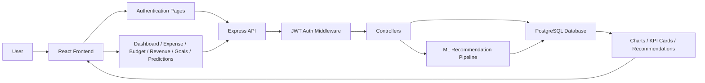

 # AI-Based Financial Adviser Project

## 1. Project Overview

This repository contains a full-stack financial management application for small businesses and entrepreneurs. It combines a React-based frontend, an Express/Node.js backend, and a PostgreSQL database to provide:

- user authentication and profile management
- expense and revenue tracking
- monthly budget planning
- financial health scoring
- revenue, expense, and cash-flow forecasting
- goal tracking and growth recommendations
- a machine-learning-oriented recommendation layer

The product is designed to help users understand their business finances, identify risk areas, and plan actions based on historical transaction trends.

---

## 2. Purpose and Product Goals

The application aims to give business owners a practical dashboard for:

- monitoring cash inflows and outflows
- comparing spending to budgets
- identifying unhealthy expense ratios
- predicting future financial behavior
- receiving AI-style recommendations for saving and growth

---

## 3. Tech Stack

### Frontend

- React 19
- React Router DOM
- Material UI (MUI)
- Axios for API calls
- Chart.js and react-chartjs-2 for visualizations
- Create React App (react-scripts)

### Backend

- Node.js
- Express.js
- PostgreSQL via pg
- JWT-based authentication
- bcryptjs for password hashing
- CORS and dotenv support

### Data / ML Layer

- Python
- SQLAlchemy
- pandas
- PostgreSQL connection for analytics and recommendation pipelines

### Database

- PostgreSQL (Neon-hosted in current setup)
- SQL scripts under the database folder for schema, migration, and seed data

---

## 4. Repository Structure

```text
AI-based-Financial-Adviser-Project/
├── backend/
│   ├── app.js                  # Present but currently empty; server bootstrapping lives in server.js
│   ├── server.js               # Main backend entry point
│   ├── package.json            # Backend dependencies and scripts
│   ├── .env                    # Local environment configuration
│   ├── config/
│   │   └── db.js               # PostgreSQL pool and connection helper
│   ├── controllers/            # Business logic for each feature area
│   │   ├── authController.js
│   │   ├── budgetController.js
│   │   ├── expenseController.js
│   │   ├── financialHealthController.js
│   │   ├── goalsController.js
│   │   ├── growthPlanController.js
│   │   ├── predictionController.js
│   │   └── revenueController.js
│   ├── middleware/
│   │   └── authMiddleware.js   # JWT verification middleware
│   ├── models/                 # Currently empty; schema is handled through raw SQL
│   ├── routes/
│   │   ├── authRoutes.js
│   │   ├── budgetRoutes.js
│   │   ├── expenseRoutes.js
│   │   ├── financialHealthRoutes.js
│   │   ├── goalsRoutes.js
│   │   ├── growthPlanRoutes.js
│   │   ├── predictionRoutes.js
│   │   └── revenueRoutes.js
│   ├── services/
│   └── utils/
├── frontend/
│   ├── package.json            # Frontend dependencies and scripts
│   ├── public/
│   └── src/
│       ├── App.js              # Application router and route setup
│       ├── App.test.js
│       ├── index.js
│       ├── Components/
│       │   ├── Charts/         # Revenue, bar, pie chart components
│       │   ├── layouts/        # Header, sidebar, app layout
│       │   ├── pages/          # Route-level pages
│       │   └── ui/             # Reusable cards and score widgets
│       ├── routers/
│       │   └── ProtectedRoute.jsx
│       ├── S_Data/
│       └── assetes/
├── database/
│   ├── schema.sql              # Main relational schema
│   ├── migration.sql           # Migration-style SQL file
│   └── seed.sql                # Seed data for sample users and transactions
├── ml_model/
│   ├── database/
│   │   └── db_connection.py
│   ├── recommendations/
│   │   ├── budget_advice.py
│   │   ├── expense_reduction.py
│   │   ├── investment_tip.py
│   │   ├── risk_alert.py
│   │   └── saving_suggestion.py
│   ├── training/
│   │   ├── train_expense_model.py
│   │   └── train_revenue_model.py
│   ├── trained_models/
│   ├── utils/
│   │   ├── build_financial_metrics.py
│   │   ├── profit_prediction.py
│   │   └── recommendation_engine.py
│   └── __init__.py
├── README.md
└── brain.md
```

### Key Folder Notes

- backend/controllers contains the core domain logic for CRUD operations and analytics.
- backend/routes exposes the public API surface.
- frontend/src/Components/pages contains the route pages such as login, dashboard, expenses, budget, revenue, predictions, goals, and profile.
- database stores the relational schema and initial data.
- ml_model is a separate analytics/recommendation pipeline that connects to the same database and can generate recommendation outputs.

---

## 5. Frontend Architecture

The frontend is a React single-page application with route-based pages.

### Routing Overview

Routes are declared in [frontend/src/App.js](frontend/src/App.js) and include:

- `/` -> landing/home page
- `/login` -> authentication
- `/signup` -> registration
- `/forgetPassword` -> password recovery UI
- `/dashboard` -> protected dashboard
- `/profile` -> protected profile page
- `/expenses` -> protected expense tracker
- `/budget` -> budget management
- `/revenues` -> revenue management
- `/predictions` -> forecasting page
- `/goals` -> goal planning page

### Layout Structure

- [frontend/src/Components/layouts/index.jsx](frontend/src/Components/layouts/index.jsx) wraps pages with a shared header and sidebar.
- [frontend/src/routers/ProtectedRoute.jsx](frontend/src/routers/ProtectedRoute.jsx) blocks access to protected screens unless a token exists.

### UI Composition

- [frontend/src/Components/pages/deshboardPage.jsx](frontend/src/Components/pages/deshboardPage.jsx) renders summary cards and charts.
- [frontend/src/Components/ui/FinancialHealthScoreCard.jsx](frontend/src/Components/ui/FinancialHealthScoreCard.jsx) displays the computed financial health status.
- Different feature pages use Axios to call the backend directly using JWT tokens stored in localStorage.

---

## 6. Backend Architecture

The backend is a modular Express application centered around route handlers and database-backed controllers.

### Entry Point

- [backend/server.js](backend/server.js) starts the Express server, enables CORS, parses JSON, connects to PostgreSQL, and mounts all API routers.

### Request Flow

1. A frontend request hits an Express route.
2. The route delegates to a controller.
3. The controller reads or writes data using the shared PostgreSQL pool.
4. The response is sent back as JSON.
5. The frontend updates local state and displays the result.

### Main Backend Modules

- auth routes and controller manage signup, login, and profile access.
- expense, revenue, and budget controllers handle CRUD operations.
- financialHealthController computes a score from expense, revenue, and budget values.
- predictionController calculates simple linear-regression-based forecasts.
- growthPlanController generates actionable recommendations from live financial data.
- goalsController manages goal progress and status updates.

---

## 7. API Routes and Data Flow

### Authentication

- POST /api/auth/signup
- POST /api/auth/login
- GET /api/auth/profile
- PUT /api/auth/profile

### Expenses

- GET /api/expenses
- POST /api/expenses
- DELETE /api/expenses/:id

### Budgets

- GET /api/budgets
- POST /api/budgets
- PUT /api/budgets/:id
- DELETE /api/budgets/:id

### Revenue

- GET /api/revenues
- POST /api/revenues
- PUT /api/revenues/:id
- DELETE /api/revenues/:id

### Predictions

- GET /api/predictions/expense
- GET /api/predictions/revenue
- GET /api/predictions/cashflow

### Financial Health

- GET /api/financial-health

### Goals

- GET /api/goals
- POST /api/goals
- PUT /api/goals/:id
- DELETE /api/goals/:id

### Growth Recommendations

- GET /api/growth-plan/recommendations

### Data Flow Pattern

- Frontend stores a JWT token in localStorage after login.
- Protected pages attach the token as an Authorization header.
- The backend middleware validates the token and populates req.user.
- Controllers resolve data from PostgreSQL and return structured JSON.
- The frontend renders cards, charts, and data tables based on the API response.

---

## 8. Database Models and Relationships

The project uses PostgreSQL with raw SQL queries rather than a dedicated Sequelize model layer. The schema is defined in [database/schema.sql](database/schema.sql).

### Core Tables

- users
  - primary account owner record
  - one-to-many with departments, expenses, revenues, budgets, goals, predictions, and recommendations
- departments
  - belongs to a user
  - can be linked to expenses, revenues, and budgets
- expense_categories
  - lookup table for categories such as Salary, Rent, Ads Spend, Cloud Hosting, Inventory, and Software Tools
- expenses
  - stores individual business expense transactions
  - linked to users, departments, and expense categories
- revenue
  - stores income entries
  - linked to users and departments
- budgets
  - stores planned monthly budgets by department and year/month
- financial_health_scores
  - stores computed health metrics for historical analysis
- predictions
  - stores forecast values and confidence scores for future expense/revenue/cash-flow
- alerts
  - intended for warnings and reminders
- goals
  - stores business targets and progress toward them
- ai_recommendations
  - stores AI-generated advice items

### Relationship Summary

- users -> departments (1:N)
- users -> expenses (1:N)
- users -> revenue (1:N)
- users -> budgets (1:N)
- users -> goals (1:N)
- users -> predictions (1:N)
- users -> ai_recommendations (1:N)
- departments -> expenses/revenue/budgets (1:N)
- expense_categories -> expenses (1:N)

---

## 9. Authentication Flow

1. A user submits signup or login information from the React UI.
2. The frontend sends the data to /api/auth/signup or /api/auth/login.
3. The backend checks the PostgreSQL users table.
4. On signup, the password is hashed with bcrypt and stored.
5. On login, the password is verified and a JWT is issued.
6. The frontend stores the JWT in localStorage.
7. Protected routes require a token and use the middleware to validate it.
8. The authenticated user ID is used in subsequent database queries.

### Notes

- The JWT secret is expected from the environment.
- The frontend currently persists auth state using localStorage rather than a more secure session pattern.

---

## 10. Key Modules and Features

### Expense Management

- Add, view, and delete expenses
- Supports category, department, payment method, frequency, and date
- Categories are resolved dynamically and can be created automatically on insert

### Revenue Management

- Track revenue sources and related departments
- Supports editing and deletion

### Budget Management

- Create monthly departmental budgets
- Prevent duplicate budgets for the same department/month/year
- Compare actual spending against planned budgets

### Financial Health Scoring

- Computes profitability, expense ratio, revenue growth, budget efficiency, and cash-flow metrics
- Produces an overall score and status message

### Predictions

- Uses linear regression over recent monthly history
- Forecasts expense, revenue, and cash flow
- Includes confidence scores and recommendations

### Goals and Growth Planning

- Create and track target-based goals
- Estimate progress from revenue and expense movements
- Generate recommendations based on current financial position

---

## 11. Environment Variables

The backend relies on environment variables for local configuration.

### Expected Variables

- DATABASE_URL
  - PostgreSQL connection string for the app and analytics layer
- JWT_SECRET
  - Secret used to sign and verify JWTs
- PORT
  - Port for the Express server (default is 5000)

### Security Note

- Do not commit secrets to the repository.
- The current project includes a real-looking connection string in local files; this should be rotated or moved to a secure environment for production.

### Frontend Notes

- The UI currently uses hardcoded API URLs such as http://localhost:5000 rather than a centralized environment variable.

---

## 12. Important Commands

### Install Dependencies

```bash
cd backend && npm install
cd ../frontend && npm install
```

### Run Backend (development)

```bash
cd backend
npm run dev
```

### Run Backend (production-style start)

```bash
cd backend
npm start
```

### Run Frontend

```bash
cd frontend
npm start
```

### Build Frontend

```bash
cd frontend
npm run build
```

### Run Tests

```bash
cd frontend
npm test
```

> Testing coverage is currently minimal; the frontend contains a default CRA test file, but no comprehensive app-level test suite is in place.

---

## 13. Debugging and Testing Notes

### Backend Debugging

- Start the backend with npm run dev for automatic restarts during development.
- Check console logs for database connection and controller errors.
- The PostgreSQL connection is initialized when the server starts.

### Frontend Debugging

- Browser dev tools are useful for inspecting API responses and localStorage auth state.
- The app uses React Router and lazy-loaded pages, so route issues are easiest to spot via console errors.

### Database Debugging

- Use the SQL scripts in database/ to recreate or reset the schema.
- The backend uses direct SQL queries and expects the tables to exist.
- The ml_model scripts also connect directly to PostgreSQL and can be used to inspect or debug financial metrics.

### Current Testing Status

- There is no mature automated test suite for the backend.
- The frontend has CRA test support but no meaningful feature tests yet.

---

## 14. Deployment Process

### Suggested Deployment Flow

1. Provision a managed PostgreSQL database.
2. Set environment variables for the backend service:
   - DATABASE_URL
   - JWT_SECRET
   - PORT
3. Deploy the backend to a Node.js hosting platform.
4. Build the frontend and deploy it to a static host or frontend platform.
5. Update the frontend API base URL from localhost to the deployed backend URL.

### Production Considerations

- Replace hardcoded localhost API endpoints with environment-driven configuration.
- Use a secure cookie or a more hardened token strategy instead of localStorage if possible.
- Add proper CORS configuration for the production domain.
- Add automated deployment and environment validation steps.

---

## 15. Developer Notes and Known Issues

### Known / Likely Improvement Areas

- The frontend currently uses hardcoded API URLs such as http://localhost:5000. This should be centralized.
- [backend/app.js](backend/app.js) is present but empty; the actual server bootstrapping is in [backend/server.js](backend/server.js).
- The project mixes direct SQL queries and a lightweight manual setup; there is no unified ORM model layer.
- The root package.json is effectively empty and does not provide convenience scripts for running the full stack together.
- The frontend route for /budget is not wrapped in ProtectedRoute unlike most other authenticated pages.
- Auth state management relies on localStorage, which is acceptable for demo purposes but is not the most secure production approach.
- The ML module uses its own database connection string and is not yet fully integrated into the main runtime flow.

### Resolved Issues
- **Dynamic Dashboard**: The dashboard previously rendered static charts (with duplicate RevenueCharts) and hardcoded KPI cards. It is now fully dynamic, rendering 4 distinct real-time charts (Revenue & Expense Trend line, Revenue vs Expenses bar, Category Breakdown pie, and Top Categories bar) and KPI cards loaded from `/api/reports/summary` and `/api/reports/charts`.
- **Database Schema Mismatch (message column)**: Fixed query error where the backend requested a non-existent `message` column in the `financial_health_scores` table.
- **Goals Table Constraints**: Removed restrictive CHECK constraint on the `status` column of the `goals` table to allow dynamic status labels ('Completed', 'On Track', 'At Risk') to be mapped properly. Fixed `goal.title` column query issues.

### Maintenance Tips

- Keep the SQL schema in sync with the actual controller expectations.
- If new routes are added, update the frontend pages and the route documentation.
- Keep any new API endpoints consistent with the existing response shape: { success, data, message }.

---

## 16. Visual Project Flow Diagram



---

## 17. Recommended Next Steps for Developers

- centralize API configuration in one frontend utility module
- add a reusable auth service and request interceptor
- introduce a formal testing strategy for both frontend and backend
- replace hardcoded environment values with proper deployment variables
- standardize error handling and response shapes across all controllers
- consider consolidating the ML pipeline into the main application workflow

This document should serve as the primary onboarding reference for understanding the application architecture, the data model, and the main development workflow.
