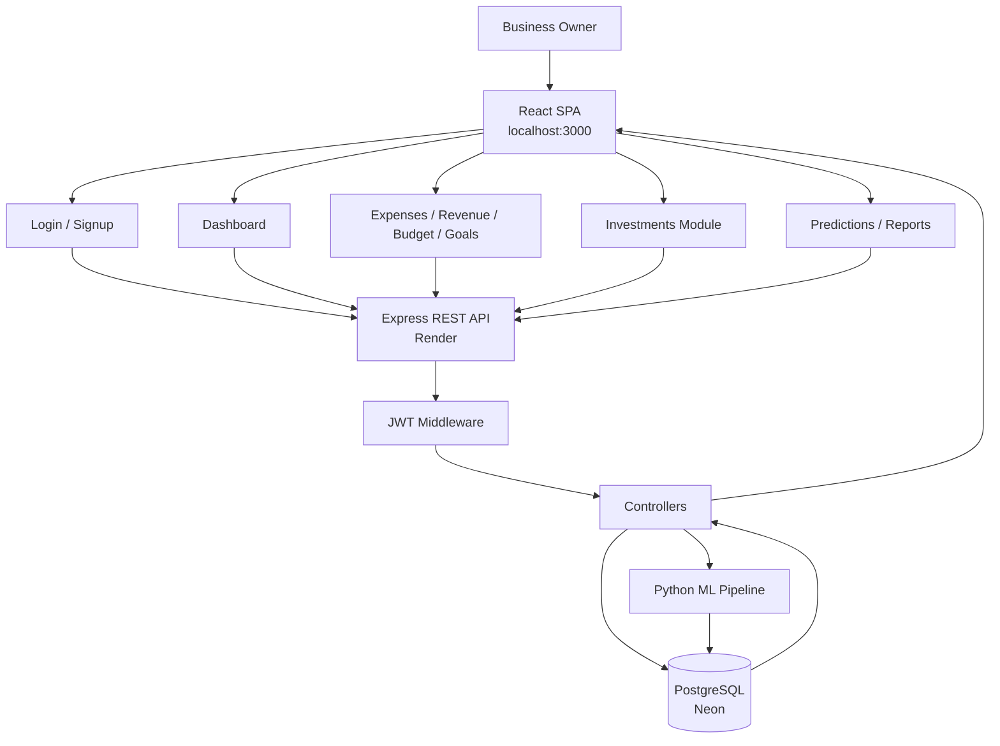

# AI-Based Financial Adviser Project — Brain

## 1. Project Overview & Core Purpose

This is a full-stack **AI-based financial decision-support system** designed for small businesses and entrepreneurs. It analyzes a business's revenue, expenses, profit, and cash flow to understand its financial condition, then provides **personalized AI-based recommendations** on how the business can utilize surplus money through suitable investments or growth opportunities to generate additional income and support long-term growth.

### What the system does:
- Tracks all financial activity: revenue, expenses, budgets, and goals
- Computes a real-time **Financial Health Score** across 5 dimensions
- Forecasts future expense, revenue, and cash flow using linear regression
- Generates **AI-powered investment recommendations** (stocks, gold, FDs, mutual funds)
- Guides users on surplus deployment for business growth

---

## 2. Product Goals

| Goal | Description |
|---|---|
| Financial Visibility | Real-time view of cash inflows and outflows |
| Risk Detection | Identify overspending, poor budget utilization, and declining margins |
| Predictive Intelligence | Forecast next-month financials using historical trend data |
| Surplus Deployment | Recommend investments (stocks, gold, FDs) based on available surplus |
| Growth Planning | Actionable growth-plan recommendations from financial data |
| Goal Tracking | Set revenue/profit targets and measure progress over time |

---

## 3. Tech Stack

### Frontend
- **React 19** (Create React App)
- **React Router DOM v7** — lazy-loaded route-based SPA
- **Material UI (MUI) v9**
- **Axios** — API requests with JWT Authorization header
- **Chart.js + react-chartjs-2** — Line, Bar, Pie charts

### Backend
- **Node.js + Express.js** — REST API server
- **PostgreSQL via `pg`** — raw SQL, no ORM
- **JWT** — stateless auth (`Authorization: <token>`)
- **bcryptjs** — password hashing
- **Deployed on**: Render — `https://ai-based-financial-adviser-project-v1.onrender.com`

### ML / Analytics Layer
- **Python** — standalone analytics pipeline
- **pandas + SQLAlchemy** — data processing and DB connection
- Modules: `budget_advice`, `expense_reduction`, `investment_tip`, `risk_alert`, `saving_suggestion`

### Database
- **PostgreSQL** — hosted on **Neon** (serverless)
- Schema managed via raw SQL in `database/`

---

## 4. Repository Structure

```
AI-based-Financial-Adviser-Project/
├── backend/
│   ├── server.js               # Express entry point — mounts all routes
│   ├── config/db.js            # PostgreSQL pool + connectDB()
│   ├── middleware/authMiddleware.js  # JWT verification → req.user
│   ├── controllers/
│   │   ├── authController.js
│   │   ├── expenseController.js
│   │   ├── revenueController.js
│   │   ├── budgetController.js
│   │   ├── financialHealthController.js
│   │   ├── predictionController.js
│   │   ├── reportsController.js
│   │   ├── goalsController.js
│   │   └── growthPlanController.js
│   └── routes/
│       ├── authRoutes.js
│       ├── expenseRoutes.js
│       ├── revenueRoutes.js
│       ├── budgetRoutes.js
│       ├── financialHealthRoutes.js
│       ├── predictionRoutes.js
│       ├── reportRoutes.js
│       ├── goalsRoutes.js
│       └── growthPlanRoutes.js
├── frontend/
│   └── src/
│       ├── App.js              # All lazy-loaded routes
│       ├── routers/ProtectedRoute.jsx
│       └── Components/
│           ├── layouts/        # Navbar, Sidebar, Layout wrapper
│           ├── pages/
│           │   ├── deshboardPage.jsx
│           │   ├── expenses.jsx
│           │   ├── revenue.jsx
│           │   ├── budget.jsx
│           │   ├── predictions.jsx
│           │   ├── goals.jsx
│           │   ├── financialReport.jsx
│           │   ├── profilePage.jsx
│           │   ├── loginPage.jsx
│           │   ├── signupPage.jsx
│           │   ├── forgetPassword.jsx
│           │   ├── homePage.jsx
│           │   └── investments/
│           │       ├── moneyInvestments.jsx
│           │       ├── stockRecommendationsPage.jsx
│           │       ├── goldAnalysisPage.jsx
│           │       ├── fdComparisonPage.jsx
│           │       ├── myPortfolioPage.jsx
│           │       └── aiRecommendationsPage.jsx
│           └── ui/
│               └── FinancialHealthScoreCard.jsx
├── database/
│   ├── schema.sql
│   ├── migration.sql
│   └── seed.sql
├── ml_model/
│   ├── recommendations/
│   ├── training/
│   ├── utils/
│   └── database/db_connection.py
├── brain.md          ← Primary project reference
├── architecture.md   ← System architecture deep-dive
├── PRD.md            ← Product Requirements Document
└── README.md
```

---

## 5. Frontend Routes

| Route | Component | Protected | Description |
|---|---|---|---|
| `/` | homePage.jsx | No | Landing page |
| `/login` | loginPage.jsx | No | JWT login |
| `/signup` | signupPage.jsx | No | Registration |
| `/forgetPassword` | forgetPassword.jsx | No | Password recovery |
| `/dashboard` | deshboardPage.jsx | Yes | KPI cards + 4 charts |
| `/expenses` | expenses.jsx | Yes | Expense CRUD |
| `/revenues` | revenue.jsx | Yes | Revenue CRUD |
| `/budget` | budget.jsx | NO ⚠️ | Budget management (missing ProtectedRoute) |
| `/predictions` | predictions.jsx | Yes | Forecasts |
| `/goals` | goals.jsx | Yes | Goal tracking |
| `/reports` | financialReport.jsx | Yes | Full financial report |
| `/profile` | profilePage.jsx | Yes | User profile |
| `/investments` | moneyInvestments.jsx | Yes | Investments hub |
| `/investments/stocks` | stockRecommendationsPage.jsx | Yes | Stock picks |
| `/investments/gold` | goldAnalysisPage.jsx | Yes | Gold analysis |
| `/investments/fd` | fdComparisonPage.jsx | Yes | FD comparison |
| `/investments/portfolio` | myPortfolioPage.jsx | Yes | Portfolio tracker |
| `/investments/recommendations` | aiRecommendationsPage.jsx | Yes | AI recommendations |

---

## 6. API Surface

### Auth — `/api/auth`
- POST `/api/auth/signup`
- POST `/api/auth/login`
- GET `/api/auth/profile`
- PUT `/api/auth/profile`

### Expenses — `/api/expenses`
- GET / POST / DELETE `:id`

### Revenue — `/api/revenues`
- GET / POST / PUT `:id` / DELETE `:id`

### Budgets — `/api/budgets`
- GET / POST / PUT `:id` / DELETE `:id`

### Financial Health — `/api/financial-health`
- GET (computes 5-dimension score)

### Predictions — `/api/predictions`
- GET `/api/predictions/expense`
- GET `/api/predictions/revenue`
- GET `/api/predictions/cashflow`

### Reports — `/api/reports`
- GET `/api/reports/summary` — KPI data
- GET `/api/reports/charts` — chart data
- GET `/api/reports/full` — full report
- GET `/api/reports/pdf` — PDF export
- Query params: `?filter=this_month|last_3_months|last_6_months|last_12_months|custom&fromDate=&toDate=`

### Goals — `/api/goals`
- GET / POST / PUT `:id` / DELETE `:id`

### Growth Plan — `/api/growth-plan`
- GET `/api/growth-plan/recommendations`

### Standard Response Shape
```json
{ "success": true, "data": { ... }, "message": "..." }
```

---

## 7. Authentication Flow

1. User submits credentials from React UI
2. POST `/api/auth/login` → bcrypt verify → JWT issued
3. Frontend stores JWT in `localStorage` as `"token"`
4. Protected API calls send `Authorization: <token>`
5. `authMiddleware.js` verifies JWT → sets `req.user = { id, email }`
6. `ProtectedRoute.jsx` redirects to `/login` if no token

> ⚠️ localStorage auth is acceptable for demos but not production-secure.

---

## 8. Database Schema

| Table | Purpose |
|---|---|
| users | Root entity — account holder |
| departments | Business departments |
| expense_categories | Lookup: Salary, Rent, Ads, Cloud, Inventory, Software |
| expenses | Expense transactions |
| revenue | Income entries |
| budgets | Monthly planned budgets per department |
| financial_health_scores | Computed health metrics |
| predictions | Forecast values + confidence scores |
| goals | Business targets with progress tracking |
| ai_recommendations | AI-generated advice |
| alerts | Warnings and reminders |

---

## 9. Resolved Issues

| Issue | Fix |
|---|---|
| Dashboard showed ₹0 (defaulted to "This Month" with no Oct 2026 data) | Changed default filter to `?filter=last_3_months` in deshboardPage.jsx |
| `financial_health_scores.message` column did not exist | Updated query to remove missing column |
| Goals table CHECK constraint too restrictive | Removed CHECK constraint |
| Dashboard was static (hardcoded charts) | Rebuilt with dynamic `/api/reports/summary` + `/api/reports/charts` |
| All frontend API URLs pointed to localhost | Updated 13 files to Render URL |

---

## 10. Known Open Issues

| Issue | Priority |
|---|---|
| `/budget` route not protected | Medium |
| Hardcoded Render URL in 13 files (no central api client) | Medium |
| localStorage auth | Low (demo acceptable) |
| ML model not integrated into runtime | Low |
| No automated test suite | Medium |
| `backend/app.js` is empty (entry point is server.js) | Low |

---

## 11. Developer Commands

```bash
# Backend
cd backend && npm install
npm run dev      # development (nodemon)
npm start        # production

# Frontend
cd frontend && npm install
npm start        # http://localhost:3000
npm run build    # production bundle
npm test

# Database
# Run database/schema.sql → database/seed.sql against your PostgreSQL instance
```

---

## 12. Deployment

- **Backend**: Render — `https://ai-based-financial-adviser-project-v1.onrender.com`
- **Database**: Neon PostgreSQL — connected via `DATABASE_URL` env var
- **Frontend**: Build with `npm run build`, deploy static bundle
- **Env vars needed**: `DATABASE_URL`, `JWT_SECRET`, `PORT`

---

## 13. System Flow


```mermaid
flowchart TD
    U[Business Owner] --> FE[React SPA\nlocalhost:3000]
    FE --> Auth[Login / Signup]
    FE --> Dash[Dashboard]
    FE --> Fin[Expenses / Revenue / Budget / Goals]
    FE --> Inv[Investments Module]
    FE --> Pred[Predictions / Reports]

    Auth --> API[Express REST API\nRender]
    Dash --> API
    Fin --> API
    Inv --> API
    Pred --> API

    API --> MW[JWT Middleware]
    MW --> Ctrl[Controllers]
    Ctrl --> DB[(PostgreSQL\nNeon)]
    Ctrl --> ML[Python ML Pipeline]
    ML --> DB
    DB --> Ctrl
    Ctrl --> FE
```

---

*Last updated: 2026-10-02. Primary onboarding and reference document for the project.*
